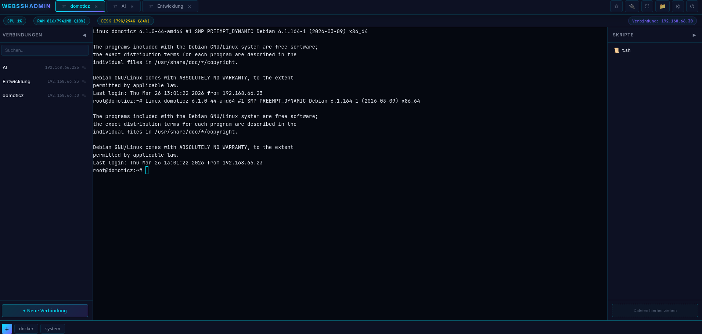

# webSSHadmin

Ein modernes, funktionsreiches webbasiertes SSH-Management-System mit Multi-User-Unterstützung, Gruppenverwaltung, SFTP-Dateibrowser, Session-Sharing, Active-Directory-Integration. Gebaut mit Node.js, xterm.js und Socket.io.



---

## Features

### Terminal & Sessions

- **Multi-Tab SSH Sessions** — Mehrere SSH-Verbindungen gleichzeitig in Tabs verwalten
- **Tab-Rename** — Doppelklick auf Tab-Label zum Umbenennen
- **Drag-and-Drop Tabs** — Tab-Reihenfolge per Drag-and-Drop ändern
- **Fullscreen-Modus** — Maximiert den Terminal-Bereich, Escape zum Verlassen
- **Auto-Reconnect** — Automatische Wiederverbindung bei SSH-Abbruch (5 Versuche, exponentielles Backoff)
- **Scrollback-Buffer** — Terminal-Verlauf bleibt bei Reconnect erhalten (100.000 Zeichen)
- **Clickable Links** — URLs im Terminal sind anklickbar (xterm WebLinks Addon)
- **Visueller Reconnect-Indikator** — Tab zeigt Status bei Wiederverbindungsversuchen

### Verbindungsverwaltung

- **SSH-Profile** — Verbindungen mit Name, Host, Port, Username speichern
- **Auth-Methoden** — Passwort oder Private Key (mit optionaler Passphrase)
- **SSH-Tunnel** — Port-Forwarding (Local Port → Remote Host:Port) pro Verbindung konfigurierbar, Bind-Adresse wählbar
- **Suche/Filter** — Verbindungsliste nach Name, Host oder Username durchsuchen
- **Sortierung** — Benutzerdefinierte Reihenfolge der Verbindungen
- **Eigene & Gruppen-Verbindungen** — Sidebar zeigt eigene Verbindungen und Gruppen-Verbindungen getrennt an

### Gruppenverwaltung

- **Gruppenbasierte Verbindungen** — Admins erstellen Gruppen mit gemeinsamen SSH-Verbindungen
- **Mitgliederverwaltung** — Benutzer zu Gruppen hinzufügen/entfernen (Admin)
- **Gruppen-Verbindungen** — Gemeinsame SSH-Verbindungen pro Gruppe definieren (Host, Port, Auth, Tunnel)
- **Per-User Credentials** — Wenn eine Gruppen-Verbindung ohne Login-Daten angelegt wird, können Mitglieder eigene Zugangsdaten hinterlegen
- **Gespeicherte Credentials** — Benutzerspezifische Login-Daten werden verschlüsselt gespeichert und beim nächsten Verbinden automatisch verwendet
- **Credential-Verwaltung** — 🔒/🔓 Icon an Gruppen-Verbindungen zum Eingeben/Bearbeiten eigener Login-Daten

### Session-Sharing

- **Live-Session teilen** — Aktive Terminal-Sessions per Share-Link mit anderen teilen
- **Zwei Rollen** — **Viewer** (nur zusehen, keine Eingabe) oder **Coworker** (volle Terminal-Kontrolle)
- **Share-URL** — Einmaliger Link mit Token, auch ohne Login nutzbar
- **Rollen-Upgrade** — Viewer kann nachträglich zum Coworker hochgestuft werden
- **Token-Verwaltung** — Aktive Shares einsehen, kopieren und widerrufen

### SFTP Dateibrowser

- **Datei-Navigation** — Vor/Zurück, Übergeordneter Ordner, Home-Verzeichnis, direkter Pfad
- **Datei-Upload** — Drag-and-Drop oder Button (Mehrfachauswahl)
- **Datei-Download** — Einzelne Dateien herunterladen (bis ~50 MB)
- **Datei-Editor** — Integrierter Ace Editor mit Syntax-Highlighting für 25+ Sprachen
- **Auto-Erkennung** — Syntax-Modus wird automatisch anhand des Dateinamens erkannt
- **Neue Dateien/Ordner** — Direkt auf dem Remote-Server erstellen
- **Umbenennen & Löschen** — Dateien und Verzeichnisse verwalten
- **Datei-Metadaten** — Größe, Berechtigungen, Änderungsdatum, UID/GID

### Skript-Manager

- **Skript-Bibliothek** — Lokale Skripte in Baumstruktur anzeigen
- **Drag-and-Drop Upload** — Skripte per Drag-and-Drop hochladen (max. 10 MB)
- **Remote-Ausführung** — Skripte auf dem verbundenen Server ausführen (Upload nach /tmp, chmod +x)
- **Live-Updates** — Änderungen an der Skript-Bibliothek werden in Echtzeit erkannt (chokidar)

### Quick Commands

- **Kategorien** — Befehle in Kategorien organisieren (Footer-Leiste)
- **Schnellzugriff** — Häufig verwendete Befehle mit einem Klick ausführen
- **Verwaltung** — Kategorien und Befehle erstellen, bearbeiten, löschen

### Port Dashboard

- **Host-Port-Übersicht** — Alle belegten Ports des Docker-Host-Systems anzeigen
- **Prozess-Zuordnung** — Welcher Prozess belegt welchen Port
- **Docker-Integration** — Container-Name und Image pro Port (via Docker Socket)
- **Filter** — Nach Port, Prozess, Container oder Bind-Adresse suchen
- **Auto-Refresh** — Automatische Aktualisierung alle 10 Sekunden
- **System-Ports** — Ports < 1024 werden farblich hervorgehoben

### Bookmarks

- **Link-Verwaltung** — Externe Admin-Tools und Webseiten als Bookmarks speichern
- **Dropdown-Menü** — Schnellzugriff über die Header-Leiste
- **Neuer Tab** — Bookmarks öffnen sich in einem neuen Browser-Tab

### System-Status

- **CPU-Auslastung** — Echtzeit-Anzeige in Prozent
- **RAM-Verbrauch** — Verwendet/Gesamt in MB mit Prozentanzeige
- **Disk-Auslastung** — Festplattennutzung mit Prozentanzeige
- **Farbcodierung** — Grün (< 50%), Gelb (50–80%), Rot (> 80%)
- **Aktive Verbindung** — IP-Adresse der aktiven Session in der Statusleiste

### Multi-User-System

Zwei Rollen mit abgestuften Berechtigungen (+ Viewer-Zugriff via Session-Sharing):

| Aktion | Admin | User | Viewer (Share) |
|---|:---:|:---:|:---:|
| Eigene Verbindungen verwalten | ✓ | ✓ | — |
| Session erstellen | ✓ | ✓ | — |
| Terminal-Eingabe | ✓ | ✓ | Coworker |
| Terminal zusehen | ✓ | ✓ | ✓ |
| Session beenden | ✓ | ✓ | — |
| Session teilen | ✓ | ✓ | — |
| Quick Commands | ✓ | ✓ | — |
| SFTP | ✓ | ✓ | — |
| Skripte ausführen | ✓ | ✓ | — |
| Benutzer verwalten | ✓ | — | — |
| Gruppen verwalten | ✓ | — | — |
| Gruppen-Verbindungen nutzen | ✓ | ✓ | — |
| Eigene Credentials speichern | ✓ | ✓ | — |
| Passwort ändern | ✓ | ✓ | — |
| Theme ändern | ✓ | ✓ | ✓ |
| Port Dashboard | ✓ | ✓ | ✓ |

- **Benutzerverwaltung** — Admin kann User anlegen, bearbeiten, löschen (Einstellungen → Benutzerverwaltung)
- **Gruppenverwaltung** — Admin kann Gruppen erstellen, Mitglieder und Verbindungen verwalten

### Active Directory / LDAP SSO

- **Optionale AD-Integration** — Login über Active Directory / LDAP konfigurierbar
- **Login-Methode wählbar** — Bei aktiviertem AD kann zwischen „Lokal" und „AD" gewählt werden
- **Automatische Benutzeranlage** — Beim ersten AD-Login wird automatisch ein lokaler Account erstellt
- **Gruppen-Synchronisation** — AD-Gruppen werden bei jedem Login mit lokalen Gruppen abgeglichen
- **Gruppen-Mapping** — AD-Gruppen auf App-Gruppen mappen per JSON-Konfiguration
- **Admin-Promotion** — Mitglieder definierter AD-Gruppen erhalten automatisch Admin-Rechte
- **Passwort-Sperre** — AD-Benutzer können ihr Passwort nur im Active Directory ändern

### Theme-System

Vier Themes mit vollständiger Anpassung von UI, Terminal und Editor:

- **Neon Dark** — Cyan/Violett auf dunklem Hintergrund (Standard)
- **Midnight Blue** — Blau-fokussiertes dunkles Theme
- **Emerald** — Grün/Teal Farbschema
- **Light** — Helles Theme mit blauem Akzent

Themes werden per `localStorage` gespeichert und wirken sich auf die gesamte UI, alle offenen Terminals und den Ace-Editor aus.

### Sicherheit

- **AES-256-GCM Verschlüsselung** — SSH-Passwörter, Private Keys und Passphrases sind verschlüsselt in der Datenbank gespeichert
- **bcrypt Password-Hashing** — Benutzer-Passwörter mit bcrypt (12 Rounds) gehasht
- **Rate-Limiting** — Max. 10 Login-Versuche pro 15 Minuten pro IP
- **Security Headers** — Helmet.js mit Content-Security-Policy, X-Frame-Options, X-Content-Type-Options, Referrer-Policy
- **Session-Sicherheit** — httpOnly, sameSite=strict Cookies, auto-generiertes Session-Secret
- **Path-Traversal-Schutz** — Pfad-Validierung bei Skript-Upload und -Ausführung
- **Input-Validierung** — Port-Range, Pflichtfelder, Passwort-Mindestlänge (8 Zeichen)
- **Letzter-Admin-Schutz** — Der letzte Admin-Account kann nicht gelöscht oder herabgestuft werden
- **Verschlüsselte Gruppen-Credentials** — Auch benutzerspezifische Zugangsdaten für Gruppen-Verbindungen werden AES-256-GCM verschlüsselt

---

## Tech Stack

| Komponente | Technologie |
|---|---|
| **Frontend** | Vanilla JavaScript, xterm.js, Ace Editor, Socket.io Client |
| **Backend** | Node.js 20, Express, Socket.io, ssh2 |
| **Datenbank** | SQLite (better-sqlite3, WAL-Modus, automatische Migrationen) |
| **Authentifizierung** | bcrypt, express-session, Optional: ldapjs (Active Directory) |
| **Sicherheit** | helmet, crypto (AES-256-GCM), express-rate-limit |
| **Echtzeit** | Socket.io (Terminal I/O, SFTP, Stats, Skripte, Sharing) |
| **Deployment** | Docker, Docker Compose |
| **Fonts** | Inter (UI), JetBrains Mono (Terminal/Code) |

---

## Installation

### Voraussetzungen

- Docker und Docker Compose
- Zugriff auf den Docker-Host (für Port Dashboard: Docker Socket wird read-only gemountet)

### Option A: Docker Hub (empfohlen)

Das fertige Image direkt von Docker Hub verwenden:

```bash
docker pull bmetallica/websshadmin:latest
```

`docker-compose.yml` erstellen:

```yaml
services:
  web-ssh:
    image: bmetallica/websshadmin:latest
    network_mode: host
    environment:
      - PORT=2222
      - DB_PATH=/app/data/database.sqlite
      - SCRIPTS_PATH=/app/scripts
    volumes:
      - ./scripts:/app/scripts
      - ./config:/app/config
      - ./data:/app/data
      - /var/run/docker.sock:/var/run/docker.sock:ro
    restart: always
```

```bash
docker compose up -d
```

### Option B: Selbst bauen

```bash
git clone https://github.com/bmetallica/webSSHadmin.git
cd webSSHadmin
docker compose up -d --build
```

Die Anwendung ist dann unter **http://localhost:2222** erreichbar.

### 3. Erster Login

| Feld | Wert |
|---|---|
| Benutzername | `admin` |
| Passwort | `admin` |

> **Wichtig:** Passwort nach dem ersten Login sofort ändern (Einstellungen → Passwort ändern).

---

## Konfiguration

### Umgebungsvariablen

| Variable | Standard | Beschreibung |
|---|---|---|
| `PORT` | `2222` | Server-Port |
| `DB_PATH` | `/app/data/database.sqlite` | Pfad zur SQLite-Datenbank |
| `SCRIPTS_PATH` | `/app/scripts` | Pfad zur Skript-Bibliothek |
| `SESSION_SECRET` | auto-generiert | Session-Verschlüsselungsschlüssel (wird auch für AES-Verschlüsselung der SSH-Credentials verwendet) |

### Active Directory / LDAP (optional)

| Variable | Standard | Beschreibung |
|---|---|---|
| `AD_ENABLED` | `false` | AD-Authentifizierung aktivieren |
| `AD_URL` | — | LDAP-Server URL (z.B. `ldap://dc.example.com`) |
| `AD_BASE_DN` | — | Base DN (z.B. `dc=example,dc=com`) |
| `AD_BIND_DN` | — | Service-Account DN für LDAP-Suche |
| `AD_BIND_PASSWORD` | — | Service-Account Passwort |
| `AD_USER_FILTER` | `(sAMAccountName={{username}})` | LDAP-Filter zur Benutzersuche |
| `AD_GROUP_FILTER` | `(member={{dn}})` | LDAP-Filter für Gruppenmitgliedschaft |
| `AD_GROUP_MAP` | `{}` | JSON-Mapping: AD-Gruppe → App-Gruppe (z.B. `{"AD-Server-Team":"server-prod"}`) |
| `AD_DEFAULT_ROLE` | `user` | Standard-Rolle für neue AD-Benutzer (`admin` oder `user`) |
| `AD_ADMIN_GROUPS` | — | Kommagetrennte AD-Gruppen, deren Mitglieder Admin-Rechte erhalten |

### docker-compose.yml

```yaml
services:
  web-ssh:
    build: .
    network_mode: host
    environment:
      - PORT=2222
      - DB_PATH=/app/data/database.sqlite
      - SCRIPTS_PATH=/app/scripts
      # Active Directory (optional)
      # - AD_ENABLED=true
      # - AD_URL=ldap://dc.example.com
      # - AD_BASE_DN=dc=example,dc=com
      # - AD_BIND_DN=cn=svc-webssh,ou=ServiceAccounts,dc=example,dc=com
      # - AD_BIND_PASSWORD=geheim
      # - AD_USER_FILTER=(sAMAccountName={{username}})
      # - AD_GROUP_FILTER=(member={{dn}})
      # - AD_GROUP_MAP={"AD-Server-Team":"server-prod","AD-Dev-Team":"development"}
      # - AD_DEFAULT_ROLE=user
      # - AD_ADMIN_GROUPS=WebSSH-Admins
    volumes:
      - ./scripts:/app/scripts
      - ./config:/app/config
      - ./data:/app/data
      - /var/run/docker.sock:/var/run/docker.sock:ro
    restart: always
```

### Volumes

| Pfad | Beschreibung |
|---|---|
| `./data` | SQLite-Datenbank und Session-Secret |
| `./scripts` | Skript-Bibliothek (wird im Skript-Manager angezeigt) |
| `./config` | Konfigurationsdateien |
| `/var/run/docker.sock` | Docker Socket (read-only, für Port Dashboard und Container-Erkennung) |

### HTTPS / Reverse Proxy

Die Anwendung läuft standardmäßig über HTTP. Für Produktivbetrieb wird ein Reverse Proxy (z.B. Nginx, Traefik, Caddy) mit TLS-Terminierung empfohlen.

Beispiel Nginx-Konfiguration:

```nginx
server {
    listen 443 ssl;
    server_name ssh.example.com;

    ssl_certificate     /etc/ssl/certs/cert.pem;
    ssl_certificate_key /etc/ssl/private/key.pem;

    location / {
        proxy_pass http://127.0.0.1:2222;
        proxy_http_version 1.1;
        proxy_set_header Upgrade $http_upgrade;
        proxy_set_header Connection "upgrade";
        proxy_set_header Host $host;
        proxy_set_header X-Real-IP $remote_addr;
        proxy_set_header X-Forwarded-For $proxy_add_x_forwarded_for;
        proxy_set_header X-Forwarded-Proto $scheme;
    }
}
```

> Bei Verwendung von HTTPS kann in `server/index.js` die Cookie-Option `secure: true` und `hsts: true` in der Helmet-Konfiguration aktiviert werden.

---

## Projektstruktur

```
webSSHadmin/
├── public/                    # Frontend
│   ├── css/main.css          # Alle Styles (Theme-fähig via CSS-Variablen)
│   ├── js/
│   │   ├── app.js            # Hauptinitialisierung, Socket-Events, Rollen-Logik
│   │   ├── terminal.js       # xterm.js Terminal-Verwaltung
│   │   ├── tabs.js           # Tab-Verwaltung (Rename, Drag-and-Drop)
│   │   ├── conmen.js         # Verbindungsverwaltung (Sidebar, Gruppen-Credentials)
│   │   ├── skriptmen.js      # Skript-Manager (Sidebar rechts)
│   │   ├── quickcon.js       # Quick Commands (Footer)
│   │   ├── sftp.js           # SFTP Dateibrowser + Ace Editor
│   │   ├── stats.js          # System-Statistiken
│   │   ├── theme.js          # Theme-System + Einstellungen-Dropdown
│   │   ├── portdash.js       # Port Dashboard
│   │   ├── bookmarks.js      # Bookmark-Verwaltung
│   │   ├── usermen.js        # Benutzerverwaltung (Admin)
│   │   ├── groupmen.js       # Gruppenverwaltung (Admin)
│   │   ├── sharing.js        # Session-Sharing (Token, Rollen)
│   │   ├── auth.js           # Passwort-Änderung, Logout
│   │   └── login.js          # Login-Formular (Lokal / AD)
│   ├── vendor/               # xterm.js, Socket.io Client
│   ├── app.html              # Hauptseite (nach Login)
│   ├── index.html            # Login-Seite
│   └── favicon.svg           # Neon-Gradient Favicon
├── server/
│   ├── index.js              # Express-Server, Middleware, Socket.io
│   ├── config.js             # Konfiguration, Session-Secret-Generierung
│   ├── db.js                 # SQLite-Schema, Migrationen (9 Migrationen)
│   ├── auth.js               # requireAuth, requireRole Middleware
│   ├── routes/
│   │   ├── auth.js           # Login (Lokal + AD), Logout, Passwort ändern
│   │   ├── connections.js    # CRUD Verbindungen + Gruppen-Credentials API
│   │   ├── users.js          # CRUD Benutzer (Admin)
│   │   ├── groups.js         # Gruppen, Mitglieder, Gruppen-Verbindungen
│   │   ├── bookmarks.js      # CRUD Bookmarks
│   │   ├── quickCommands.js  # CRUD Quick Commands + Kategorien
│   │   ├── scripts.js        # Skript-Upload + Baum
│   │   ├── ports.js          # Port-Scanner API
│   │   └── sharing.js        # Share-Token erstellen, validieren, verwalten
│   ├── socket/
│   │   ├── index.js          # Socket-Handler-Registrierung
│   │   ├── terminalHandler.js # Session-Verwaltung, Terminal I/O, Credential-Merge
│   │   ├── sftpHandler.js    # SFTP-Operationen
│   │   ├── statsHandler.js   # Statistik-Events
│   │   └── scriptHandler.js  # Remote-Skript-Ausführung
│   └── services/
│       ├── sessionManager.js # SSH-Sessions, Auto-Reconnect, Tunnels, Sharing
│       ├── sshConnection.js  # SSH2-Client-Aufbau
│       ├── adAuth.js         # Active Directory / LDAP Authentifizierung
│       ├── statsPoller.js    # CPU/RAM/Disk Polling via SSH
│       ├── portScanner.js    # Port-Scan (ss/netstat + Docker API)
│       ├── encryption.js     # AES-256-GCM Verschlüsselung
│       └── scriptWatcher.js  # Dateiüberwachung (chokidar)
├── scripts/                  # Skript-Bibliothek (Volume)
├── data/                     # SQLite DB + Session-Secret (Volume)
├── config/                   # Konfiguration (Volume)
├── Dockerfile
├── docker-compose.yml
└── build_and_push.sh         # Build + Registry-Push Skript
```

---

## Lizenz

MIT
